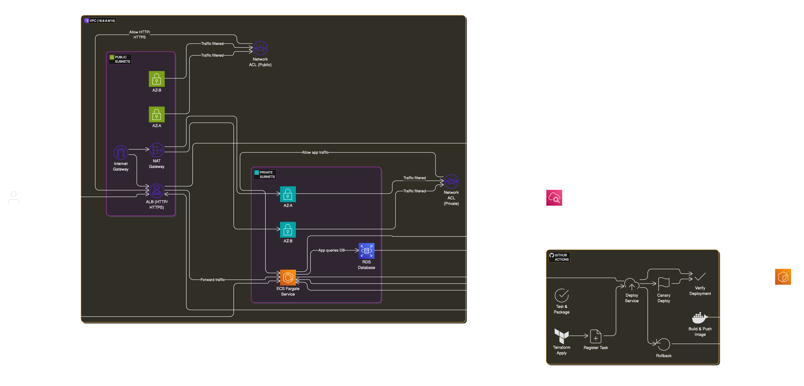

# DevOps & Deployment Guide

This document outlines the infrastructure architecture, networking, security, and CI/CD pipeline for deploying the Spring PetClinic application on AWS Fargate using Terraform and GitHub Actions.

---

## Table of Contents

1. [Architecture Diagram](#architecture-diagram)
2. [Infrastructure Components](#infrastructure-components)
3. [Networking & Security](#networking--security)
4. [CI/CD Pipeline](#cicd-pipeline)
5. [Deployment Best Practices](#deployment-best-practices)
6. [Quick Start](#quick-start)

---

## Architecture Diagram

Below is the end-to-end architecture diagram for our AWS Fargate deployment. You can view the high-resolution diagram in the repository:

---

## Infrastructure Components

| Component                     | Purpose                                           |
| ----------------------------- | ------------------------------------------------- |
| **VPC**                       | Custom VPC with public & private subnets          |
| **Internet Gateway (IGW)**    | Provides internet ingress/egress                  |
| **NAT Gateway**               | Enables private subnet egress                     |
| **Application Load Balancer** | Distributes HTTP/HTTPS traffic to ECS service     |
| **ECR Repository**            | Stores Docker images for each environment         |
| **ECS Cluster (Fargate)**     | Serverless container orchestration                |
| **Task Definition**           | Defines container settings (CPU, memory, ports)   |
| **ECS Service**               | Manages task count, health, and deployments       |
| **RDS Database**              | Managed relational storage in private subnets     |
| **Security Groups**           | Controls traffic between ALB, ECS tasks, and RDS  |
| **IAM Roles**                 | ECS execution role for ECR pull & CloudWatch logs |

---

## Networking & Security

* **Public Subnets**: Hosts ALB and NAT Gateway; reachable via IGW.
* **Private Subnets**: Hosts ECS Fargate tasks and RDS; no direct internet access.
* **Security Groups**:

  * **ALB SG**: Allow inbound 80/443; outbound to ECS SG.
  * **Fargate SG**: Allow inbound from ALB SG; outbound to RDS SG & NAT Gateway.
  * **RDS SG**: Allow inbound only from Fargate SG.
* **Network ACLs**: Optional subnet-level filters.
* **IAM**: Least-privilege roles for ECS tasks and CI runners.

---

## CI/CD Pipeline

1. **Build & Test**

   * Compile code (Maven/Gradle), run unit and integration tests.
2. **Docker Build & Push**

   * Build container, tag with commit SHA, push to ECR.
3. **Terraform Provision**

   * Apply infrastructure: VPC, subnets, ALB, RDS, ECS cluster.
4. **Register Task Definition**

   * `aws ecs register-task-definition` → exports `TASK_DEF_ARN`.
5. **Deploy Service**

   * `create-service` if new, else `update-service --force-new-deployment`.
6. **Verify Deployment**

   * `aws ecs wait services-stable` ensures healthy rollout.
7. **Cleanup (Optional)**

   * Tear down dev/staging resources via `terraform destroy` and cleanup scripts.

---

## Deployment Best Practices

* **Immutable Infrastructure**: Keep Terraform state remote and versioned.
* **Zero‑Downtime Deployments**: Use rolling or canary strategies with ALB target groups.
* **Scaling**: Configure ECS Service Auto Scaling on CPU/memory or custom CloudWatch metrics.
* **Logging & Monitoring**: Centralize logs in CloudWatch; set alarms for error rates and resource usage.
* **Secrets Management**: Store DB credentials and API keys in AWS Secrets Manager or Parameter Store.
* **Network Segmentation**: Strict security group rules and private subnets for sensitive data.

---

## Quick Start

1. Fork or clone the repo.
2. Add AWS credentials and secrets in GitHub (ECR, RDS, Terraform state).
3. Update Terraform variables (`environment`, `vpc_id`, `db_username`, `db_password`).
4. Trigger the **Deploy PetClinic** workflow or push to `dev`/`main`.
5. Access your app via the ALB DNS name or custom domain.

---

*For full development instructions, refer to [README.md](./README.md).*

---

*This deployment design merges best practices with automated Terraform and GitHub Actions to deliver a robust, secure, and scalable PetClinic setup on AWS Fargate.*
